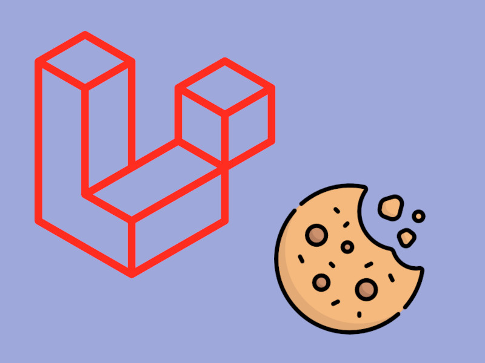
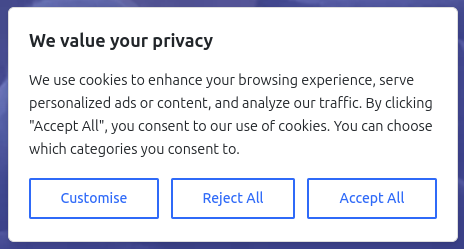
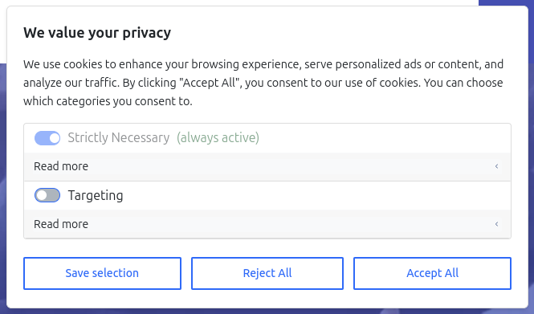
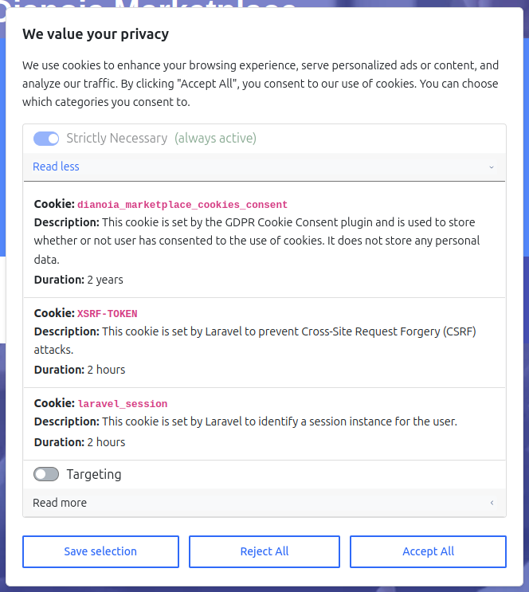
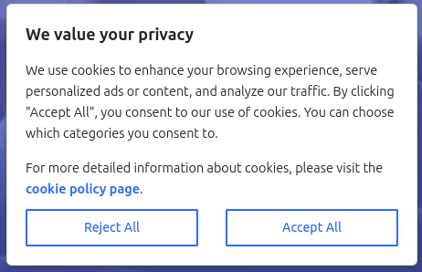

<!-- omit in toc -->

# Laravel Cookie Guard - Make your Laravel app compliant with the EU GDPR cookie law

The only Consent Plugin your **Laravel app** will ever need!

<p align="center">

</p>

<hr>

[](https://packagist.org/packages/scify/laravel-cookie-guard)
[](https://github.com/scify/laravel-cookie-guard/actions?query=workflow%3Arun-tests+branch%3Amain)
[](https://packagist.org/packages/scify/laravel-cookie-guard)
[](https://img.shields.io/github/issues/scify/laravel-cookie-guard)
[](https://img.shields.io/github/stars/scify/laravel-cookie-guard)
[](https://img.shields.io/github/forks/scify/laravel-cookie-guard)
[](https://github.com/dwyl/esta/issues)
[](https://opensource.org/licenses/Apache-2.0)
[](https://GitHub.com/Naereen/StrapDown.js/graphs/commit-activity)
[](https://GitHub.com/scify)
[](https://github.com/scify/laravel-cookie-guard/graphs/contributors)
[](https://github.com/scify/laravel-cookie-guard/pulls)
[](https://github.com/scify/laravel-cookie-guard/pulls?q=is%3Apr+is%3Aclosed)

## Table of Contents

- [Upgrading to v4](#upgrading-to-v4)
- [About the plugin](#about-the-plugin)
- [Features](#features)
- [Installation](#installation)
  - [Explanation of the configuration file](#explanation-of-the-configuration-file)
  - [Usage](#usage)
    - [Option 1: All-in-one dialog (default)](#option-1-all-in-one-dialog-default)
    - [Option 2: Simple dialog, with a link to the default separate internal page](#option-2-simple-dialog-with-a-link-to-the-default-separate-internal-page)
    - [Option 3: Simple dialog, with a link to a customized separate internal page with navbars, footers, etc.](#option-3-simple-dialog-with-a-link-to-a-customized-separate-internal-page-with-navbars-footers-etc)
    - [Option 4: Simple dialog, with a link to an external (off-the-app) page](#option-4-simple-dialog-with-a-link-to-an-external-off-the-app-page)
    - [How to override the CSS styles](#how-to-override-the-css-styles)
  - [How to add a new cookie category](#how-to-add-a-new-cookie-category)
  - [How to check if a cookie category is allowed](#how-to-check-if-a-cookie-category-is-allowed)
    - [Backend code](#backend-code)
    - [Frontend code](#frontend-code)
  - [Customization](#customization)
    - [Customizing the component texts](#customizing-the-component-texts)
    - [Customizing the component contents](#customizing-the-component-contents)
- [Development](#development)
  - [Testing](#testing)
- [FAQ](#faq)
- [Changelog](#changelog)
- [Contributing](#contributing)
  - [PHP code style - Laravel Pint](#php-code-style---laravel-pint)
  - [Releasing a new version](#releasing-a-new-version)
- [Credits](#credits)
- [License](#license)

## Upgrading to v4

As of **March 2025**, The `v4` of the Laravel Cookies Consent plugin has been released! 🎉🥳😍
It offers a **new, revamped UI**, and a lot of new features and improvements.

**Important:**
Since the plugin now has a completely new name, you will need to uninstall the old package, and install the new one.

```bash
rm -rf public/vendor/scify && rm -rf vendor/scify

composer remove scify/laravel-cookies-consent

composer require scify/laravel-cookie-guard

php artisan vendor:publish --provider="SciFY\LaravelCookiesConsent\LaravelCookiesConsentServiceProvider" --tag="cookies-consent-public" --force

php artisan vendor:publish --provider="SciFY\LaravelCookiesConsent\LaravelCookiesConsentServiceProvider" --tag="cookies-consent-config" --force
```

Then, make sure to check the configuration file `config/cookies_consent.php` and update it according to [the new one](config/cookies_consent.php).

Then, make sure that the Laravel components you use are the new ones:

Intead of using:

```html
<x-laravel-cookies-consent></x-laravel-cookies-consent>
```

Use:

```html
<x-laravel-cookie-guard-scripts></x-laravel-cookie-guard-scripts>
<x-laravel-cookie-guard></x-laravel-cookie-guard>
```

In order to upgrade to `v4`, please follow the instructions in the [CHANGELOG](CHANGELOG.md) file, and consult also
the [How To Upgrade to a New Major Version](UPGRADING.md) file.

Then, make sure to publish the assets, the translations, and the configuration file, and update your Blade files

## About the plugin

According to the [GDPR law](https://gdpr-info.eu/), every platform is required to allow the users to decide which cookie
categories they will allow,
and, if a cookie category is not allowed, the application should not use the functionality tied to that cookie.

This plugin provides a simple cookie consent window through which the user can specify the cookies they would like to
allow.

After the user submission, the page reloads and the relevant cookies are set on the browser, and can then be used in the
front-end.

## Features

- Customizable cookie categories
- 3 Different integration options: All-in-one dialog, internal page, external separate page,
- A clean and intuitive UI for the cookies consent modal.
- A sticky cookies button and footer link that allows users to change their cookies preferences at any time. This button
  is optional, and
  it's existence can be tweaked in the configuration file.
- A separate page for the cookies preferences, where users can read more about each cookie category and change their
  preferences.
- Multilingual support. The plugin comes with 6 built-in languages: English, Greek, Spanish, German, Italian, and
  Swedish. You can add your own language by publishing the translations and editing/adding your own translations.

## Installation

You can install the package via composer:

```bash
composer require scify/laravel-cookie-guard
```

**Make sure to manually publish** the cookie image file, by running:

```bash
php artisan vendor:publish \
--provider="SciFY\LaravelCookiesConsent\LaravelCookiesConsentServiceProvider" \
--tag="cookies-consent-assets"
```

**Notice:** if a new version of the plugin has been released, and you want to update the front-end files, please make
sure to
use `--force` option, to overwrite the file.

By doing so, the image file will be copied to `public/vendor/scify/laravel-cookie-guard`.

**IMPORTANT:**

You can then either decide to include the `public/vendor/scify/laravel-cookie-guard/*` files to git (especially if
you
want
to edit it first), or add it to `.gitignore`, and make sure to also run this command on the staging/production server.

Next, you need to publish the config file:

```bash
php artisan vendor:publish \
--provider="SciFY\LaravelCookiesConsent\LaravelCookiesConsentServiceProvider" \
--tag="cookies-consent-config"
```

The configuration file will be published to `config/cookies_consent.php`.

### Explanation of the configuration file

In the config file, you can change the cookie categories of your application, set the required and pre-selected
categories, as well as add new categories.

This is the contents of the published config file:

```bash
return [
    /**
     * This prefix will be applied when setting and getting all cookies.
     * If not set, the cookies will not be prefixed.
     * If set, a good strategy is to also add a trailing underscore "_", that will be added between the field value, and each cookie.
     * For example, if `cookie_prefix` is set to `my_app_`, then the targeting cookie will have a value of `my_app_cookies_consent_targeting`.
     * When using this plugin for multiple apps, it is a good strategy to set a prefix that is relevant to the app
     * (for example "my_app_", in order for the cookies not to be mingled when running locally.
     */
    'cookie_prefix' => '',
    'display_floating_button' => true, // Set to false to display the footer link instead
    'hide_floating_button_on_mobile' => false, // Set to true to hide the floating button on mobile
    'use_separate_page' => false, // Set to true to use a separate page for cookies explanation
    'categories_collapsed_by_default' => true, // Set to false to initially collapse the optional categories
    /*
    |--------------------------------------------------------------------------
    | Editor
    |--------------------------------------------------------------------------
    |
    | Choose your preferred cookies to be shown. You can add more cookies as desired.
    | If, for example you add another cookie with the name "marketing", then you should also
    | publish the translation files and add a "cookie_marketing" key in the translation file,
    | since the plugin will try to display the cookie name by this convention.
    |
    | Built-in: "strictly_necessary"
    |
    */
    'cookies' => [
        'strictly_necessary' => [
            [
                // you need to change this in order to reflect the cookie_prefix from above
                'name' => 'my_app_cookies_consent',
                'description' => 'cookies_consent::messages.cookie_cookies_consent_description',
                'duration' => 'cookies_consent::messages.years',
                'duration_count' => 2,
                'policy_external_link' => null,
            ],
            [
                'name' => 'XSRF-TOKEN',
                'description' => 'cookies_consent::messages.cookie_xsrf_token_description',
                'duration' => 'cookies_consent::messages.hours',
                'duration_count' => 2,
                'policy_external_link' => null,
            ],
            [
                'name' => 'laravel_session',
                'description' => 'cookies_consent::messages.cookie_laravel_session_description',
                'duration' => 'cookies_consent::messages.hours',
                'duration_count' => 2,
                'policy_external_link' => null,
            ],
        ],
    ],
    'enabled' => [
        'strictly_necessary',
    ],
    'required' => ['strictly_necessary'],
    /*
     * Set the cookie duration in days.  Default is 365 days.
     */
    'cookie_lifetime' => 365,
];
```

The `cookie_prefix` is optional and, if set, will be applied to every cookie.

If set, a good strategy is to also add a trailing underscore "_", that will be added between the field value, and each
cookie.

For example, if `cookie_prefix` is set to `my_app_`, then the targeting cookie will have a value
of `my_app_cookies_consent_targeting`.

The `display_floating_button` field is optional and, if set to `true`, will display a floating button in the bottom
right corner of the page.
If set to `false`, then you will need to add a relevant link in your footer, in order to show the cookies preferences
page:

```html
<a href="javascript:void(0);" onclick="toggleCookieBanner()" onkeyup="if (event.key === 'Enter') toggleCookieBanner()"
   role="button" aria-label="{{ __('cookies_consent::messages.cookies_settings') }}">
  {{ __('cookies_consent::messages.cookies_settings') }}
</a>
```

The `hide_floating_button_on_mobile` field is optional and, if set to `true`, will hide the floating button on mobile

The `use_separate_page` field is optional and, if set to `true`, will display the cookies preferences in a separate
page.

The `categories_collapsed_by_default` field is optional and, if set to `false`, will initially collapse the optional
categories.
If set to `true`, all categories will be collapsed by default.

You can add as many cookie categories as you like, simply by adding values to the `cookies` array.

If you want to remove a cookie category, simply remove it from the array.

You can use the `enabled` array to set the cookie categories that will be pre-selected,
and the `required` array to set the cookies that the user won't be able to deselect.

If you want to change how long the cookies will be stored, edit the `cookie_lifetime` variable.

## Usage

### Option 1: All-in-one dialog (default)

**Suitable for**: Apps that would like to show a single dialog with all the cookie categories.

When the plugin is installed, a `laravel-cookie-guard`
custom [Laravel View Component](https://laravel.com/docs/9.x/blade#components) is automatically registered.

This will render the following cookies consent that, will look very much like this one.



When the user cliks on "Customise", they will see the following dialog:



They then can open each cookies category and see the cookies:



You can then use this component in order to display the cookies consent window, wherever you'd like.

Typically, a good strategy is to put the component just before the closing `<body>` tag:

```html

<body>
...
...
...
<x-laravel-cookie-guard></x-laravel-cookie-guard>
<x-laravel-cookie-guard-scripts></x-laravel-cookie-guard-scripts>
</body>
```

(Or you can put the scripts in the `<head>` tag, if you prefer).

### Option 2: Simple dialog, with a link to the default separate internal page

**Suitable for**: Apps that would like to show a simple "Accept all/Reject Optional" dialog with a link to a separate
page for customizing the cookies preferences.

Edit the `config/cookies_consent.php` file, and set the `use_separate_page` field to `true`.

```php
    'use_separate_page' => true,
```

When the plugin is installed, a `/cookie-policy/{locale}` route is automatically registered.
So, you can edit the `config/cookies_consent.php` file, and set the `use_separate_page` field to `true`.

Now, the user will see a simple dialog, with a link to the `/cookie-policy/{locale}` page, where they can customize
their cookies preferences.
This page is managed by the plugin, and it will show the cookies categories, descriptions, and the ability to accept or
reject them.

### Option 3: Simple dialog, with a link to a customized separate internal page with navbars, footers, etc.

**Suitable for**: Apps that would like to show a simple "Accept all/Reject Optional" dialog with a link to a customized
page, with the app's own content (navigation, footer, etc).

If you would like to show a simple "Accept all/Reject Optional" dialog with a link to a separate page for customizing
the cookies preferences, you can set the following in the `config/cookies_consent.php` file:

```php
'use_separate_page' => true,
'cookie_policy_page_custom_url' => '/my-custom-cookies-policy',
```

```php
Route::get('/my-custom-cookies-policy', function () {
    return view('my-custom-cookies-policy');
});
```

Or you can declare your route to override the default one:

```php
'use_separate_page' => true,
'cookie_policy_page_custom_url' => null,
```

And then create a new route in your `routes/web.php` file:

```php
Route::get('/cookie-policy/{locale}', function () {
    return view('my-custom-cookies-policy');
});
```

Then, you can create a new route in your `routes/web.php` file:

Now, in the `resources/views/my-custom-cookies-policy.blade.php` file, you will need to render the
`x-laravel-cookie-guard-page` component, in order to show the cookies preferences dialog.

Here is a usage example:

```bladehtml
@extends('layouts.app')
@section('head)
<x-laravel-cookie-guard-scripts></x-laravel-cookie-guard-scripts>
@endsection
@section('content')
<x-laravel-cookie-guard-page></x-laravel-cookie-guard-page>
@endsection
```

Then, the user will see an appropriate dialog, with a link to the `/my-custom-cookies-policy` page:



### Option 4: Simple dialog, with a link to an external (off-the-app) page

**Suitable for**: Apps that would like to show a simple "Accept all/Reject Optional" dialog, with a link to an external
URL.

If you would like to show a simple "Accept all/Reject Optional" dialog with a link to an external URL, you can set the
following in the `config/cookies_consent.php` file:

```php
    'use_separate_page' => true,
    'cookie_policy_page_custom_url' => 'https://www.example.com/cookies-policy',
```

Then, the user will see an appropriate dialog, with a link to the external page.

## How to override the CSS styles

If you want to override the CSS styles of the cookies consent dialog, you can do this:

```html

<x-laravel-cookie-guard></x-laravel-cookie-guard>
<x-laravel-cookie-guard-scripts></x-laravel-cookie-guard-scripts>
```

Then, you can add a `<style>` tag in your Blade file, in order to override the CSS styles:

```html

<style>
  #scify-cookies-consent, .scify-cookie-policy-page, #scify-cookie-consent-floating-button {
    --scify-cookies-primary-color: #ff5722; /* Override primary color */

    ...

    /* Add more override rules here */
  }
</style>
```

The full list of CSS variables that can be overridden can be found in the
`public/vendor/scify/laravel-cookie-guard/_variables.css` file.

## How to add a new cookie category

In order to add a new cookie category, you need to add a new entry in the `cookies` array in the configuration file:

```php
        'strictly_necessary' => [
            ...
            ...
        ],
        'targeting' => [
            [
                'name' => '_ga',
                'description' => 'This cookie is installed by Google Analytics. The cookie is used to calculate visitor, session, campaign data and keep track of site usage for the site\'s analytics report. The cookies store information anonymously and assign a randomly generated number to identify unique visitors.',
                'duration' => 'cookies_consent::messages.years',
                'duration_count' => 2,
                'policy_external_link' => 'https://policies.google.com/privacy?hl=en-US',
            ],
            [
                'name' => '_gid',
                'description' => 'This cookie is installed by Google Analytics. The cookie is used to store information of how visitors use a website and helps in creating an analytics report of how the website is doing. The data collected including the number visitors, the source where they have come from, and the pages visited in an anonymous form.',
                'duration' => 'cookies_consent::messages.days',
                'duration_count' => 1,
                'policy_external_link' => 'https://policies.google.com/privacy?hl=en-US',
            ],
            [
                'name' => '_gat',
                'description' => 'This cookies is installed by Google Universal Analytics to throttle the request rate to limit the colllection of data on high traffic sites.',
                'duration' => 'cookies_consent::messages.minutes',
                'duration_count' => 1,
                'policy_external_link' => 'https://policies.google.com/privacy?hl=en-US',
            ],
        ],
```

Or, you can set the `description` to be null (or an empty string), or set a translation key directly, like so:

1. Create a cookies-specific translation file:

```bash
 touch lang/en/cookies.php
```

Contents:

```php
<?php

return [
    'google_analytics' => [
        '_ga_description' => 'This cookie is installed by Google Analytics. The cookie is used to calculate visitor, session, campaign data and keep track of site usage for the site\'s analytics report. The cookies store information anonymously and assign a randomly generated number to identify unique visitors.',
        '_gid_description' => 'This cookie is installed by Google Analytics. The cookie is used to store information of how visitors use a website and helps in creating an analytics report of how the website is doing. The data collected including the number visitors, the source where they have come from, and the pages visited in an anonymous form.',
        '_gat_description' => 'This cookies is installed by Google Universal Analytics to throttle the request rate to limit the colllection of data on high traffic sites.',
    ]
];
```

Then, in your `config/cookies_consent.php` file, you can set the `description` fields to be the translation keys.
Notice that the `description` fields have `cookies.google_analytics.*` values: (from the `cookies.php` file we just
created).

```php
        'strictly_necessary' => [
            ...
            ...
        ],
        'targeting' => [
            [
                'name' => '_ga',
                'description' => 'cookies.google_analytics._ga_description',
                'duration' => 'cookies_consent::messages.years',
                'duration_count' => 2,
                'policy_external_link' => 'https://policies.google.com/privacy?hl=en-US',
            ],
            [
                'name' => '_gid',
                'description' => 'cookies.google_analytics._gid_description',
                'duration' => 'cookies_consent::messages.days',
                'duration_count' => 1,
                'policy_external_link' => 'https://policies.google.com/privacy?hl=en-US',
            ],
            [
                'name' => '_gat',
                'description' => 'cookies.google_analytics._gat_description',
                'duration' => 'cookies_consent::messages.minutes',
                'duration_count' => 1,
                'policy_external_link' => 'https://policies.google.com/privacy?hl=en-US',
            ],
        ],

```

## How to check if a cookie category is allowed

### Backend code

You can use the `$_COOKIE` global object, in order to check for the appropriate cookie.

Now you can use this object in your Blade files like this:

```bash
$_COOKIE[config('cookies_consent.cookie_prefix') . {{ COOKIE_NAME }}]
```

For example, An application that wants to load the Google Analytics script only if the user has given their consent to
the `targeting` cookie category,
might do the following:

```php
<!-- Check the 'targeting' cookie: -->
@if(isset($_COOKIE[config('cookies_consent.cookie_prefix') . 'cookies_consent']))
    @php
        $cookiesConsent = json_decode($_COOKIE[config('cookies_consent.cookie_prefix') . 'cookies_consent'], true);
    @endphp
    @if(isset($cookiesConsent['targeting']) && $cookiesConsent['targeting'] && config('app.google_analytics_id'))
        <!-- Google Analytics -->
        <script defer async>
            (function (i, s, o, g, r, a, m) {
                i['GoogleAnalyticsObject'] = r;
                i[r] = i[r] || function () {
                    (i[r].q = i[r].q || []).push(arguments)
                }, i[r].l = 1 * new Date();
                a = s.createElement(o),
                    m = s.getElementsByTagName(o)[0];
                a.async = 1;
                a.src = g;
                m.parentNode.insertBefore(a, m)
            })(window, document, 'script', 'https://www.google-analytics.com/analytics.js', 'ga');

            window.ga('create', '{{ config('app.google_analytics_id') }}', 'auto');
            window.ga('set', 'anonymizeIp', true);
            window.ga('send', 'pageview');
        </script>
    @endif
@endif
```

In this example, we checked whether
the `$_COOKIE[config('cookies_consent.cookie_prefix') . 'cookies_consent_targeting']` key exists or not.

### Frontend code

You can use the `window.localStorage` object, in order to check for the appropriate cookie. (declared in the
configuration file)

## Customization

### Customizing the component texts

If you want to modify the texts shown in the cookies dialog, you can publish the language resource files with this
command:

```bash
php artisan vendor:publish \
--provider="SciFY\LaravelCookiesConsent\LaravelCookiesConsentServiceProvider" \
--tag="cookies-consent-translations"
```

This will publish the translation files to `lang/vendor/scify/laravel-cookie-guard/` directory.

The plugin comes with many built-in languages. You can change the translations for a given language, or add additional
languages yourself.

### Customizing the component contents

If you need full control over the contents of the cookies dialog, you can publish the views of the package:

```bash
php artisan vendor:publish \
--provider="SciFY\LaravelCookiesConsent\LaravelCookiesConsentServiceProvider" \
--tag="cookies-consent-components"
```

This will copy the view files over to `resources/views/components/vendor/scify/laravel-cookie-guard` directory.

## Development

In order to locally run the package, you should use a local Laravel application, in which you are going to install it.

Make sure that the `composer.json` file of the Laravel app has the following entry:

```text

"require": {
    "scify/laravel-cookie-guard": "@dev",
}
...
...
"repositories": [
        {
            "type": "path",
            "url": "../path/to/laravel-cookie-guard/",
            "options": {
                "symlink": true
            }
        }
    ],
"minimum-stability": "dev",
```

This will tell composer that the code for the package is of the `"@dev"` version and that it exists in the specified
path.

Then run:

```bash
composer update scify/laravel-cookie-guard --prefer-source
```

To fetch the local package.

Or, to prune everything and re-install:

```bash
rm -rf public/vendor/scify && \
rm -rf vendor/scify && \
composer require scify/laravel-cookie-guard && \
php artisan vendor:publish --provider="SciFY\LaravelCookiesConsent\LaravelCookiesConsentServiceProvider" --tag="cookies-consent-public" --force && \
php artisan config:cache
```

### Testing

This project uses [Pest](https://pestphp.com/) for testing. To execute the test suite, run:

```bash
composer test
```

## FAQ

**Question:** Is this plugin free to use?

**Answer:** Yes. This plugin is totally free and developed as
an [Open-Source project](https://github.com/scify/laravel-cookie-guard).

---

**Question:** How long do the cookies last?

**Answer:** The duration is set in days, in `config/cookies_consent.php` file. In order to publish this file, run

```bash
php artisan vendor:publish \
--provider="SciFY\LaravelCookiesConsent\LaravelCookiesConsentServiceProvider" \
--tag="cookies-consent-config"
```

The configuration file will be published to `config/cookies_consent.php`.

Then, edit the `cookie_lifetime` field (in days).

---

**Question:** Will the cookie consent window show every time?

**Answer:** No. As soon as the user clicks one of the "Accept all", "Accept selection", or "Decline all", the selection
will be stored in another cookie, and the window won't pop up again, until this cookie expires, or is deleted.

---

**Question:** In which languages is the plugin available?

**Answer:** The plugin has 6 built-in languages: English, Greek, Spanish, German, Italian, and Swedish. If you would
like to add a language, publish the translations by running:

```bash
php artisan vendor:publish \
--provider="SciFY\LaravelCookiesConsent\LaravelCookiesConsentServiceProvider" \
--tag="cookies-consent-translations"
```

And add/change your own translations. If you add a new language, consider also opening
a [pull request](https://github.com/scify/laravel-cookie-guard/pulls), in order for this language to be included in
the plugin.

---

**Question:** Does this plugin work with all Laravel versions?

**Answer:** We have tested the plugin with Laravel 7, 8, and 9. The plugin's simplicity allows it to work with any
Laravel version, but if you try it with a version other that the tested ones and it does not work, please open an issue
on [GitHub](https://github.com/scify/laravel-cookie-guard/issues).

---

**Question:** If I install later a new cookie category, how can I force the plugin to "reset" and show again?

**Answer:** The easiest way is to publish the configuration file, and change the `cookie_prefix` field. This will force
the plugin to show again.

## Changelog

Please see [CHANGELOG](CHANGELOG.md) for more information on what has changed recently.

## Contributing

Please see [CONTRIBUTING](CONTRIBUTING.md) for general details.

### PHP code style - Laravel Pint

This application uses [Laravel Pint](https://laravel.com/docs/9.x/pint) in order to perform code-style.

In order to run the styler, run :

```bash
./vendor/bin/pint --test -v # the --test will not do any changes, it will just output the changes needed

./vendor/bin/pint -v # this command will actually perform the code style changes
```

### Releasing a new version

After you have committed your changes, create a new git tag:

```bash
git tag -a vx.y.z -m "This is a nice tag name"
```

(for the `x.y.z` version number, follow the [Semantic Versioning](https://semver.org/) guidelines).

Then, push the tag:

```bash
git push origin vx.y.z
```

Then, in the [GitHub Releases page](https://github.com/scify/laravel-cookie-guard/releases), create a new Release *
*and correlate it with the tag that you just created.**

That's it! Packagist will be updated automatically.

Also, don't forget to update the `CHANGELOG.md` file with the new version name, release date, and release notes.

## Credits

- [SciFY Dev Team](https://github.com/scify)

## License

The Apache Licence. Please see the [Licence File](LICENCE.md) for more information.
